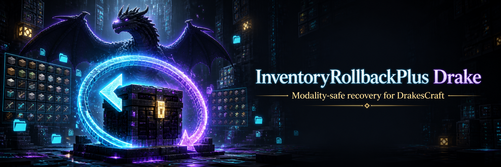
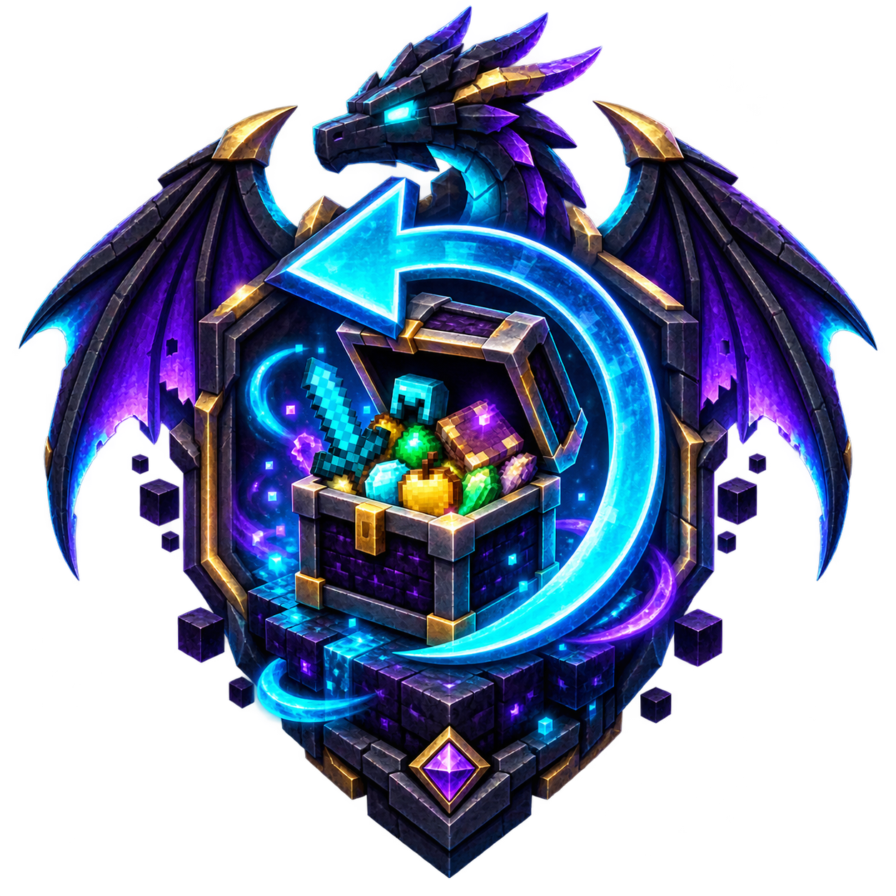

<p align="center">
  
</p>

<p align="center">
  
</p>

# InventoryRollbackPlus Drake

InventoryRollbackPlus Drake is the DrakesCraft-maintained fork of
[InventoryRollbackPlus](https://github.com/TechnicallyCoded/Inventory-Rollback-Plus). It preserves
the upstream inventory-backup and restoration workflow while adding hard separation between
DrakesCraft game modalities.

> This repository is not the original InventoryRollbackPlus project. It contains DrakesCraft-specific
> modifications maintained by [DrakesCraft Labs](https://github.com/DrakesCraft-Labs). See
> [Credits and upstream](#credits-and-upstream) for the original authors and project links.

## What this fork changes

The Drake fork currently adds:

- Modality-aware backups for Survival, Laboratory, Classic, SkyBlock and OneBlock.
- A restore flow organized as `player -> modality -> event type -> backup`.
- Filtering that prevents staff from accidentally restoring a backup from another modality.
- Protection for full-inventory restores and recovery-shulker extraction across modality groups.
- A dedicated `inventoryrollbackplus.restore.cross-group` permission for exceptional recoveries.
- A forced source-inventory snapshot before every world transition.
- A configurable five-second safety window for cross-modality travel.
- Movement cancellation during that safety window, leaving the live inventory and teleport untouched.
- Compatibility fallbacks for old backups whose modality was not stored explicitly.
- Regression coverage for modality classification, filtering and cross-group restore rules.

These changes are real server-side behavior, not documentation-only conventions. The enforcement is
implemented in the restore GUI, item extraction paths, inventory restoration and world-transition
listeners.

## Upstream features retained

InventoryRollbackPlus creates snapshots when a player joins, quits, dies, changes world or when a
staff member requests a force backup. A snapshot can contain:

- Main inventory and armor
- Ender chest
- Location
- Health and hunger
- Experience

The upstream project also provides tab completion, one-click inventory restoration, configurable
retention limits, YAML/MySQL storage support and an interactive recovery GUI.

## DrakesCraft restore workflow

Run:

```text
/irp restore <player>
```

The interface first asks for a modality. The next menu shows Death, Join, Quit, World Change and
Force Save categories, each filtered to the chosen modality. A backup from a different modality is
blocked by default even if it is reached through an older menu or direct interaction path.

Cross-group restoration should be reserved for trusted senior staff:

```text
inventoryrollbackplus.restore.cross-group
```

Do not grant `inventoryrollbackplus.*` to ordinary staff. Prefer the smallest set of permissions
required for their role.

## Commands

| Command | Purpose |
| --- | --- |
| `/irp restore <player>` | Open the modality-aware backup browser. |
| `/irp forcebackup <player>` | Create a manual player backup. |
| `/irp enable` | Enable backup processing. |
| `/irp disable` | Disable backup processing. |
| `/irp reload` | Reload the plugin configuration. |
| `/irp version` | Show build and attribution information. |

The aliases `/ir`, `/inventoryrollback` and `/inventoryrollbackplus` remain available for upstream
compatibility.

## Permissions

### Staff permissions

| Permission | Default | Purpose |
| --- | --- | --- |
| `inventoryrollbackplus.viewbackups` | OP | Browse backups without restoring them. |
| `inventoryrollbackplus.restore` | OP | Restore inventory data from the recovery GUI. |
| `inventoryrollbackplus.restore.teleport` | OP | Teleport to a saved backup location. |
| `inventoryrollbackplus.restore.cross-group` | OP | Bypass modality isolation for an exceptional recovery. |
| `inventoryrollbackplus.forcebackup` | OP | Create a manual backup. |
| `inventoryrollbackplus.enable` | OP | Enable backup processing. |
| `inventoryrollbackplus.disable` | OP | Disable backup processing. |
| `inventoryrollbackplus.reload` | OP | Reload configuration. |
| `inventoryrollbackplus.adminalerts` | OP | Receive administrative backup alerts. |

### Player/event permissions

| Permission | Default | Purpose |
| --- | --- | --- |
| `inventoryrollbackplus.deathsave` | Everyone | Save a snapshot on death. |
| `inventoryrollbackplus.joinsave` | Everyone | Save a snapshot on join. |
| `inventoryrollbackplus.leavesave` | Everyone | Save a snapshot on quit. |
| `inventoryrollbackplus.worldchangesave` | Everyone | Save a snapshot on world change. |
| `inventoryrollbackplus.help` | Everyone | View command help. |
| `inventoryrollbackplus.version` | Everyone | View version information. |

## Building

Requirements:

- Java 21
- Maven 3.9+

Build and run the test suite with:

```bash
mvn clean verify
```

The compiled plugin is written to `target/`. Never reload InventoryRollbackPlus with PlugMan on a
production server; stage the JAR and activate it through a controlled restart.

## Credits and upstream

InventoryRollbackPlus Drake exists because of the work of the original projects and their authors:

- **danjono** — original author of
  [InventoryRollback](https://www.spigotmc.org/resources/inventory-rollback.48074/), the foundation of
  the recovery system and the `me.danjono.inventoryrollback` code retained in this project.
- **TechnicallyCoded** — author and maintainer of
  [InventoryRollbackPlus](https://github.com/TechnicallyCoded/Inventory-Rollback-Plus), which extended
  the original plugin and is the direct upstream of this fork.
- **InventoryRollbackPlus contributors** — contributors to the upstream implementation and its
  compatibility work.
- **DrakesCraft Labs / Jack** — modality isolation, transition safeguards, Drake-specific recovery
  workflow, regression tests, maintenance and branding in this fork.

Upstream release page: [InventoryRollbackPlus on Modrinth](https://modrinth.com/plugin/inventoryrollbackplus).
Issues specific to this fork should be reported to the DrakesCraft Labs repository rather than to the
upstream author unless they can be reproduced on an unmodified upstream build.

## License

Copyright and authorship notices from InventoryRollback and InventoryRollbackPlus are preserved.
Review [`LICENSE`](LICENSE), [`OLD_LICENSE`](OLD_LICENSE) and
[`src/main/resources/LICENSE`](src/main/resources/LICENSE) before redistribution. The new Drake
branding does not replace or weaken any upstream attribution or license requirement.
